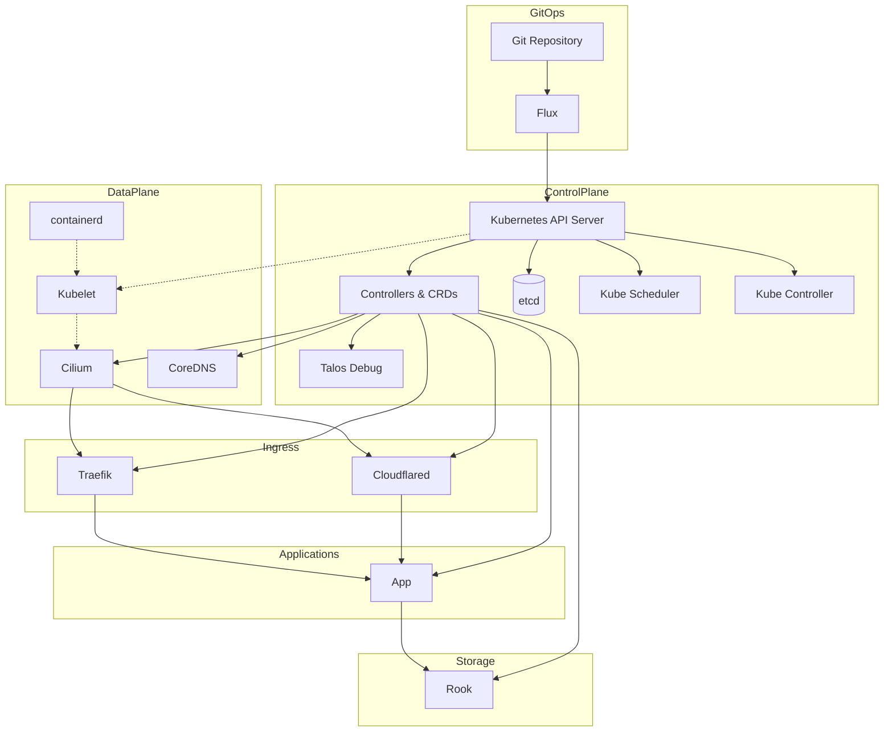

# Homelab

This repository contains Kubernetes manifests for deploying and managing resources using **Flux** in a GitOps workflow. Flux automatically applies changes from this repository to your Kubernetes cluster.

## Table of Contents

- [Prerequisites](#prerequisites)
- [Flux Setup](#flux-setup)
- [General Cluster Architecture](#general-cluster-architecture)
- [Hardware Specs](#hardware-specs)
- [Applications](#applications)
- [Resources Managed](#resources-managed)
- [Runtimes](#runtimes)

## Prerequisites

Before using this repository, ensure you have:

- **Kubernetes Cluster**: A working Kubernetes cluster.
- **Flux CLI**: [Install the Flux CLI](https://fluxcd.io/docs/installation/).
- **Git**: [Install Git](https://git-scm.com/book/en/v2/Getting-Started-Installing-Git).
- **Kubectl**: [Install kubectl](https://kubernetes.io/docs/tasks/tools/).
- **Talosctl**: [Install Talosctl](https://www.talos.dev/v1.10/talos-guides/install/talosctl/)

## Flux Setup

Flux manages the deployment of Kubernetes resources in this repository. Key resources:

- **GitRepository**: Specifies the Git repository, branch, and sync interval for Flux.
- **Kustomization**: Defines which paths and resources Flux applies to the cluster.

## General Cluster Architecture

## Hardware Specs

Below is a description of the hardware this cluster runs on. This information may be useful if you want to build a similar setup or understand resource utilization in relation to this deployment.

- Chassis: [SuperMicro SuperChassis 216](https://www.supermicro.com/en/products/chassis/2u/216/sc216be2c-r609jbod)
- PSU: [SuperMicro 920W Platinum Super Quiet](https://store.supermicro.com/920w-1u-pws-920p-sq.html)
- Motherboard: [Supermicro X13SAE-F](https://www.supermicro.com/en/products/motherboard/x13sae-f)
- CPU: [Intel 14900K](https://www.intel.com/content/www/us/en/products/sku/236773/intel-core-i9-processor-14900k-36m-cache-up-to-6-00-ghz/specifications.html)
- Memory (2x): [MEM-Store 48GB DDR5-4800MHz UDIMM ECC RAM](https://www.ebay.com/itm/205361780350?_skw=ddr5+x13sae&itmmeta=01JZ0TKE59VY4SVBFZCFZX65AM&hash=item2fd084167e:g:pYsAAOSwt3hoKGu2&itmprp=enc%3AAQAKAAAA8FkggFvd1GGDu0w3yXCmi1dRM0UvCMIXXuRtGvP1U0hYxySNWZ6v%2FH1IHx9NvHxTPBugsoKKGWAJZurMe47er848d9JodLXhjQJLTZllw0iFy0UeU7yOyJXFxEsQsbjQMukpohGX%2BupDrHUFRL2b9lanYMMNKdBWBvqApcgJV6mNUkd45LbWL91FksGhjB5BLBY0wP4Ad7nbqOfj8jNcHbMrsqnkS3miAhPWkoTubUR%2FIHgZK1ExaiV68B0Q5hLNQz1WssJtzBkAL%2BjfDvv1Ntg72LLsN6BdgOvJkT4JzFuBVsjT5gJzr9TFnTyNLTbuRg%3D%3D%7Ctkp%3ABk9SR87jzZr4ZQ)
- HBA: [LSI SAS 9300-8i](https://docs.broadcom.com/doc/12352000)
- OS Disks (2x): [Intel Optane SSD 1600X Series](https://www.intel.com/content/www/us/en/products/sku/211868/intel-optane-ssd-p1600x-series-58gb-m-2-80mm-pcie-3-0-x4-3d-xpoint/specifications.html)
- Data Disks (24x): [Samsung SAS PM1633_3840](https://download.semiconductor.samsung.com/resources/brochure/pm1633-prodoverview-2015.pdf)
- GPU: [Sparkle Intel Arc 310 Eco](https://www.sparkle.com.tw/en/products/view/f22F9bC73c50)
- TPU: [Google Coral TPU M.2](https://coral.ai/products/m2-accelerator-bm)

## Resources Managed

The following resources are managed through Flux in this repository:

- [x] **Actions Runner Controller**
- [X] **Authentik**
- [x] **Bazarr**
- [x] **BuildKit**
- [x] **Cert Manager**
- [x] **Cilium**
- [X] **Cloudflared**
- [ ] **Coder**
- [x] **Egress Gateway Helper**
- [ ] **Emissary**
- [x] **Falco**
- [ ] **Filebrowser**
- [x] **Flaresolverr**
- [x] **Gamevault**
- [x] **Grafana**
- [X] **Harbor**
- [x] **Headlamp**
- [x] **Heimdall**
- [x] **Home Assistant**
- [x] **Huntarr**
- [x] **Intel GPU Plugin**
- [x] **Jellyfin**
- [x] **Jellyseerr**
- [ ] **Kyverno**
- [x] **Kubelet CSR Approver**
- [x] **LlamaCPP**
- [ ] **Loki**
- [x] **Minecraft Server**
- [x] **MindsDB**
- [x] **Nix2Container**
- [x] **NzbGet**
- [x] **Prometheus**
- [x] **Prowlarr**
- [x] **Radarr**
- [x] **Redbot**
- [x] **Reflector**
- [x] **Requestrr**
- [ ] **Renovate**
- [x] **Rook**
- [ ] **RSPS**
- [x] **rTorrent**
- [x] **Sonarr**
- [ ] **SonarQube**
- [x] **Suwayomi**
- [ ] **Syncthing**
- [x] **Talos Debug**
- [x] **Tdarr**
- [ ] **Tempo**
- [x] **Traefik**
- [ ] **Trivy**
- [x] **Vector**
- [x] **Wizarr**
- [ ] **WoW Classic**

## Runtimes

These are the runtimes used in this cluster:

- **Container Runtimes**
  - **Default**: `runc`
  - **Experimental** `youki` (Experimental replacement for runc)
  - **Security**: `kata`

