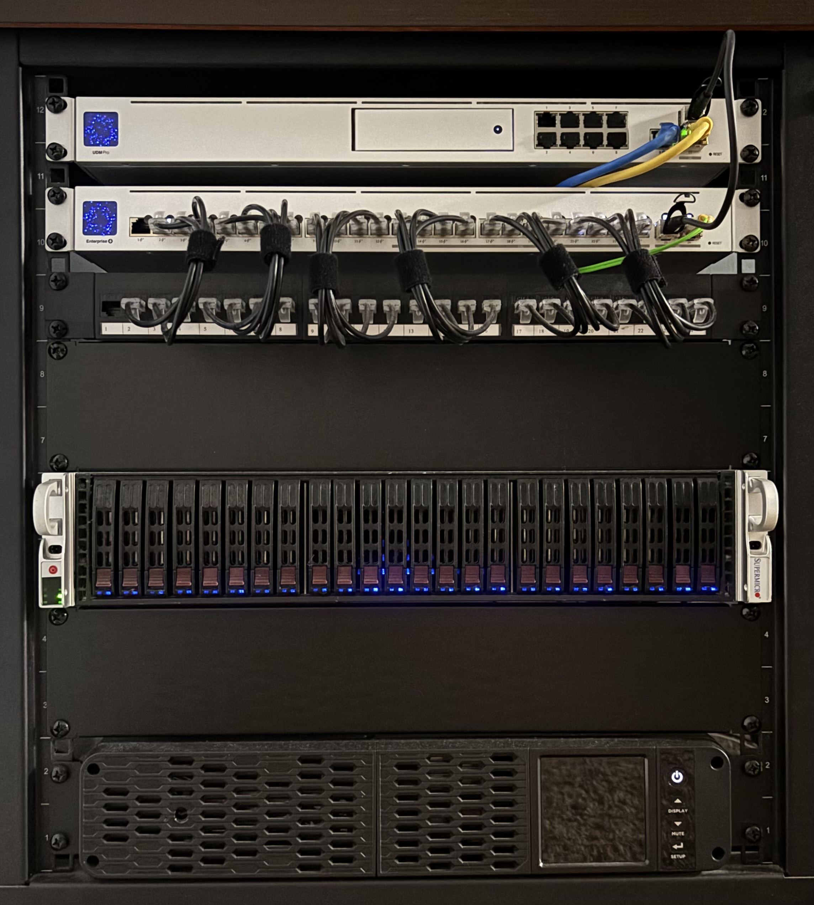

# Homelab

This repository contains Kubernetes manifests for deploying and managing resources using **Flux** in a GitOps workflow. Flux automatically applies changes from this repository to the Kubernetes cluster.

## Table of Contents

- [Prerequisites](#prerequisites)
- [General Cluster Architecture](#general-cluster-architecture)
- [Hardware](#hardware)
- [Cluster Resources](#cluster-resources)

## Prerequisites

Before using this repository, ensure you have:

- **Kubernetes Cluster**: A working Kubernetes cluster.
- **Cilium CLI**: [Install Cilium CLI](https://docs.cilium.io/en/stable/gettingstarted/k8s-install-default/#install-the-cilium-cli)
- **Flux CLI**: [Install Flux CLI](https://fluxcd.io/docs/installation/)
- **Git**: [Install Git](https://git-scm.com/book/en/v2/Getting-Started-Installing-Git)
- **Kubectl**: [Install Kubectl](https://kubernetes.io/docs/tasks/tools/)
- **OpenTofu**: [Install OpenTofu](https://opentofu.org/docs/intro/install/)
- **SOPS**: [Install SOPS](https://getsops.io/docs/#download)
- **Talosctl**: [Install Talosctl](https://www.talos.dev/v1.10/talos-guides/install/talosctl/)
- **Terragrunt**: [Install Terragrunt](https://terragrunt.gruntwork.io/docs/getting-started/install/)

Or use nix.

- **Nix**: [Install Nix](https://github.com/DeterminateSystems/nix-installer)

## General Cluster Architecture

## Hardware

Below is information on the hardware this homelab runs on:

  
Click to view Hardware List

- [UniFi Dream Machine Pro](https://store.ui.com/us/en/category/all-cloud-gateways/products/udm-pro)
- [UniFi Enterprise 24 PoE](https://store.ui.com/us/en/products/usw-enterprise-24-poe)
- Basic Patch Panel
- Supermicro Server (See Specs Below)
- [CyberPower UPS](https://www.cyberpowersystems.com/product/ups/pfc-sinewave/cp1500pfcrm2u/)

  
Click to view SuperMicro Server Specs

- Chassis: [SuperMicro SuperChassis 216](https://www.supermicro.com/en/products/chassis/2u/216/sc216be2c-r609jbod)
- PSU (2x): [SuperMicro 920W Platinum Super Quiet](https://store.supermicro.com/media/wysiwyg/productspecs/PWS-920P-SQ/PWS-920P-SQ_quick_spec.pdf)
- Motherboard: [Supermicro X13SAE-F](https://www.supermicro.com/en/products/motherboard/x13sae-f)
- CPU: [Intel i9 14900K](https://www.intel.com/content/www/us/en/products/sku/236773/intel-core-i9-processor-14900k-36m-cache-up-to-6-00-ghz/specifications.html)
- Memory (4x): [MEM-Store 48GB DDR5-4800MHz UDIMM ECC RAM](https://www.ebay.com/itm/205361780350?_skw=ddr5+x13sae&itmmeta=01JZ0TKE59VY4SVBFZCFZX65AM&hash=item2fd084167e:g:pYsAAOSwt3hoKGu2&itmprp=enc%3AAQAKAAAA8FkggFvd1GGDu0w3yXCmi1dRM0UvCMIXXuRtGvP1U0hYxySNWZ6v%2FH1IHx9NvHxTPBugsoKKGWAJZurMe47er848d9JodLXhjQJLTZllw0iFy0UeU7yOyJXFxEsQsbjQMukpohGX%2BupDrHUFRL2b9lanYMMNKdBWBvqApcgJV6mNUkd45LbWL91FksGhjB5BLBY0wP4Ad7nbqOfj8jNcHbMrsqnkS3miAhPWkoTubUR%2FIHgZK1ExaiV68B0Q5hLNQz1WssJtzBkAL%2BjfDvv1Ntg72LLsN6BdgOvJkT4JzFuBVsjT5gJzr9TFnTyNLTbuRg%3D%3D%7Ctkp%3ABk9SR87jzZr4ZQ)
- HBA: [LSI SAS 9300-8i](https://docs.broadcom.com/doc/12352000)
- OS Disks (2x): [Intel Optane SSD 1600X Series](https://www.intel.com/content/www/us/en/products/sku/211868/intel-optane-ssd-p1600x-series-58gb-m-2-80mm-pcie-3-0-x4-3d-xpoint/specifications.html)
- Data Disks (24x): [Samsung SAS PM1633_3840](https://download.semiconductor.samsung.com/resources/brochure/pm1633-prodoverview-2015.pdf)
- GPU1: [NVIDIA RTX 4000 SFF Ada](https://www.nvidia.com/en-us/products/workstations/rtx-4000-sff/)
- GPU2: [Intel Arc A310 Low Profile](https://www.sparkle.com.tw/en/A310-ECO)
- GPU2 Riser: [PCIE 4.0 X4 To X16 Riser Graphics Card Extension Cable](https://www.ebay.com/itm/195849039024?var=495695011149)
- TPU: [Google Coral TPU M.2 B+M](https://coral.ai/products/m2-accelerator-bm)

## Cluster Resources

The following resources are managed through Flux in this repository:

  
Click here to view Resources

- [**Actions Runner Controller**](https://github.com/actions/actions-runner-controller)
- [**Alloy**](https://github.com/grafana/alloy/tree/main)
- [**Authentik**](https://github.com/goauthentik/authentik)
- [**Bazarr**](https://github.com/morpheus65535/bazarr)
- [**BuildKit**](https://github.com/moby/buildkit)
- [**Cert Manager**](https://github.com/cert-manager/cert-manager)
- [**Cilium**](https://github.com/cilium/cilium)
- [**ClamAV**](https://www.clamav.net/)
- [**Cloudflared**](https://github.com/cloudflare/cloudflared)
- [**Code-Server**](https://github.com/coder/code-server)
- [**ComfyUI**](https://github.com/comfyanonymous/ComfyUI)
- [**Debian**](https://hub.docker.com/_/debian)
- [**Falco**](https://github.com/falcosecurity/falco)
- [**Filebrowser**](https://github.com/gtsteffaniak/filebrowser)
- [**Flaresolverr**](https://github.com/FlareSolverr/FlareSolverr)
- [**Glance**](https://github.com/glanceapp/glance)
- [**Grafana**](https://github.com/grafana/grafana)
- [**HAProxy**](https://github.com/jcmoraisjr/haproxy-ingress)
- [**Harbor**](https://github.com/goharbor/harbor)
- [**Home Assistant**](https://github.com/home-assistant/core)
- [**Huntarr**](https://github.com/plexguide/Huntarr.io)
- [**Intel GPU Plugin**](https://github.com/intel/intel-device-plugins-for-kubernetes)
- [**Jellyfin**](https://github.com/jellyfin/jellyfin)
- [**Jellyseerr**](https://github.com/fallenbagel/jellyseerr)
- [**Kestra**](https://github.com/kestra-io/kestra)
- [**Knative**](https://github.com/knative/serving)
- [**Kubelet CSR Approver**](https://github.com/postfinance/kubelet-csr-approver)
- [**Lazy Librarian**](https://gitlab.com/LazyLibrarian/LazyLibrarian)
- [**LibreChat**](https://github.com/danny-avila/LibreChat)
- [**Local Path Provisioner**](https://github.com/rancher/local-path-provisioner)
- [**Loki**](https://github.com/grafana/loki)
- [**Minecraft Server**](https://github.com/itzg/docker-minecraft-server)
- [**Nginx**](https://github.com/kubernetes/ingress-nginx)
- [**Nvidia Device Plugin**](https://github.com/NVIDIA/k8s-device-plugin)
- [**NzbGet**](https://github.com/nzbgetcom/nzbget)
- [**Prometheus**](https://github.com/prometheus/prometheus)
- [**Prowlarr**](https://github.com/Prowlarr/Prowlarr)
- [**Radarr**](https://github.com/Radarr/Radarr)
- [**Redbot**](https://github.com/Cog-Creators/Red-DiscordBot)
- [**Reflector**](https://github.com/emberstack/kubernetes-reflector)
- [**Requestrr**](https://github.com/thomst08/requestrr)
- [**Reloader**](https://github.com/stakater/Reloader)
- [**Renovate**](https://github.com/renovatebot/renovate)
- [**Snowflake**](https://gitlab.torproject.org/tpo/anti-censorship/pluggable-transports/snowflake/-/tree/main/proxy?ref_type=heads#running-a-standalone-snowflake-proxy)
- [**Sonarr**](https://github.com/Sonarr/Sonarr)
- [**SonarQube**](https://github.com/SonarSource/sonarqube)
- [**Subgen**](https://github.com/McCloudS/subgen)
- [**Suwayomi**](https://github.com/Suwayomi/Suwayomi-Server)
- [**Syncthing**](https://github.com/syncthing/syncthing)
- [**Tdarr**](https://github.com/HaveAGitGat/Tdarr)
- [**Tempo**](https://github.com/grafana/tempo)
- [**Traefik**](https://github.com/traefik/traefik)
- [**Vertical Pod Autoscaler**](https://github.com/kubernetes/autoscaler/tree/master/vertical-pod-autoscaler)
- [**VLLM**](https://github.com/vllm-project/vllm)
- [**Wizarr**](https://github.com/wizarrrr/wizarr)

## Star History

<a href="https://www.star-history.com/embed?secret=#0x4272616E646F6E/homelab&Date">
  <picture>
    <source media="(prefers-color-scheme: dark)" srcset="https://api.star-history.com/svg?repos=0x4272616E646F6E/homelab&type=Date&theme=dark" />
    <source media="(prefers-color-scheme: light)" srcset="https://api.star-history.com/svg?repos=0x4272616E646F6E/homelab&type=Date" />
    
  </picture>
</a>

